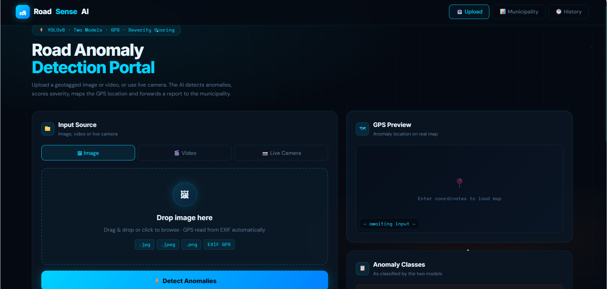
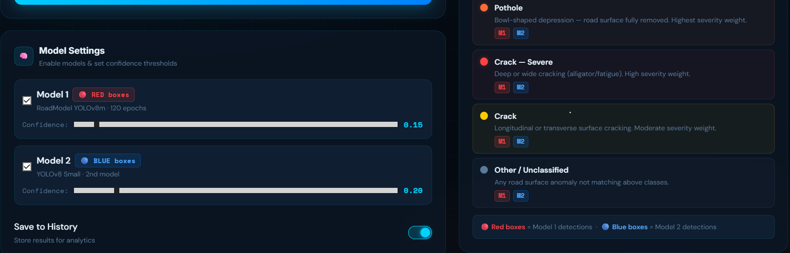
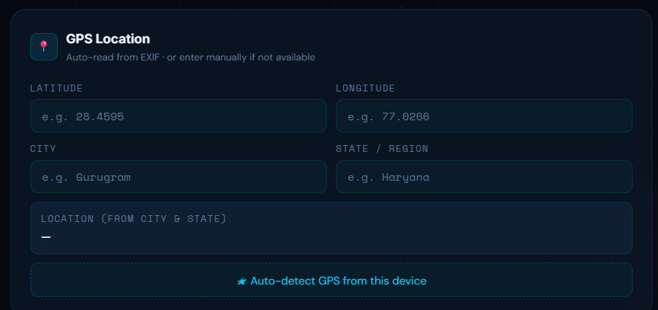
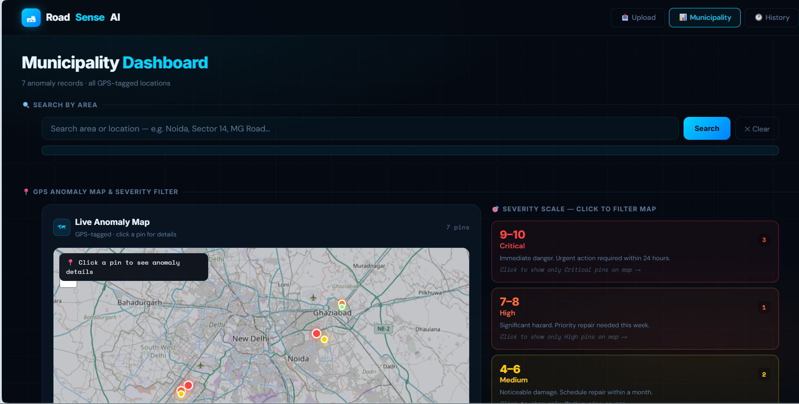
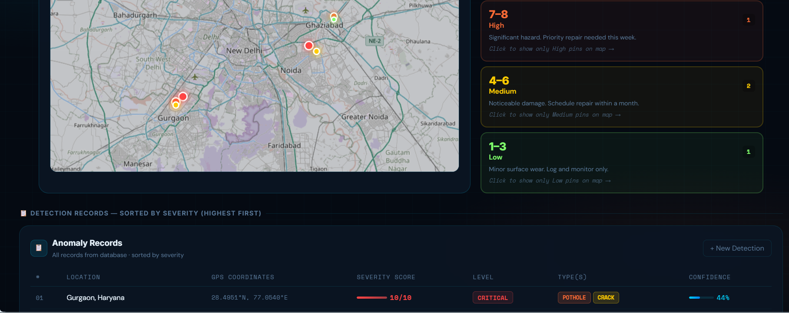
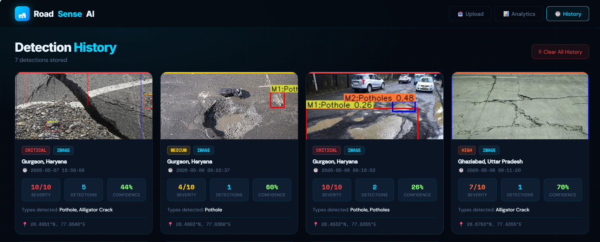

# 🛣️ RoadSense AI — Road Anomaly Detection System


**An intelligent road anomaly detection platform powered by a dual YOLOv8 model architecture. Upload geotagged images or videos, stream live camera feed, and get instant anomaly detection with severity scoring, GPS mapping, and municipality-ready reports.**

[Features](#-features) • [Dashboards](#-dashboards) • [Installation](#-installation) • [Dataset](#-dataset) • [API](#-api-endpoints)

---

## 📌 Overview

RoadSense AI is a full-stack web application that automates the detection of road surface anomalies — potholes, cracks, and severe cracks — using deep learning. The system combines two complementary YOLOv8 models to balance detection accuracy and inference speed, assigns a severity score (1–10) to each finding, pins anomalies on a real GPS map, and presents everything across three purpose-built dashboards.

**Built for:**
- Citizens and field teams who report road damage
- Municipal authorities who need to prioritize repairs
- Infrastructure management and smart city initiatives

---

## ✨ Features

### Detection
- 📷 **Image upload** — JPEG, PNG, BMP, WebP
- 🎬 **Video upload** — MP4, AVI, MOV, MKV (processed frame by frame)
- 📡 **Live camera stream** — real-time detection via device webcam (MJPEG, no external API)
- 🧠 **Dual-model architecture** — Model 1 (accuracy, red boxes) + Model 2 (speed, blue boxes) run simultaneously
- 🎚️ **Per-model confidence threshold** — independently adjustable sliders for each model
- ✅ **Toggle models** — enable or disable each model independently

### Scoring & Location
- 📊 **Severity scoring (1–10)** — AI-computed from anomaly type and bounding box area ratio
- 🗺️ **Real GPS map** — Leaflet.js with OpenStreetMap tiles; pins colored by severity level
- 📍 **GPS auto-extraction** — reads EXIF metadata from geotagged images/videos automatically
- ✍️ **Manual coordinate entry** — fallback when EXIF data is unavailable
- 🔄 **Reverse geocoding** — Nominatim API converts coordinates to human-readable city/state

### Dashboards
- 🖥️ **Upload Dashboard** — detect anomalies, view annotated results, severity display
- 🏛️ **Municipality Dashboard** — GPS map with severity filter, anomaly table, area search
- 🕐 **History Dashboard** — full detection history with thumbnail images and scores

### Municipality Tools
- 🔍 **Area search** — search by city/area name; map and table filter to matching records
- 🎯 **Severity filter** — click a severity band (1–3, 4–6, 7–8, 9–10) to isolate pins on map
- 📋 **Anomaly table** — sorted by severity (highest first), shows all anomaly types per record
- 🌐 **GPS pin coloring** — color-coded pins with pulsing animation for critical anomalies

---

## 🖼️ Dashboards

### Dashboard 1 — Upload & Detect





---

### Dashboard 2 — Municipality Analytics




---

### Dashboard 3 — Detection History



---

## 🗂️ Project Structure

```
roadsense_project/
│
├── app.py                          # Flask backend — all routes and API logic
├── inference.py                    # Dual-model inference + severity calculation
├── location_utils.py               # GPS extraction (EXIF) + Nominatim geocoding
├── config.py                       # Model paths and default confidence values
├── utils.py                        # Helper utilities
├── requirements.txt                # Python dependencies
│
├── RoadDetectionModel/             # Model 1 weights (custom trained YOLOv8m)
│   └── RoadModel_yolov8m.pt_rounds120_b9/
│       └── weights/
│           └── best.pt             ← Model 1 weights file
│
├── YOLOv8_Small_2nd_Model.pt       # Model 2 weights (YOLOv8 Small)
│
├── templates/
│   ├── index.html                  # Upload Dashboard
│   ├── analytics.html              # Municipality Dashboard
│   └── history_page.html           # History Dashboard
│
└── static/
    ├── uploads/                    # Uploaded files (auto-created)
    ├── results/                    # Annotated output files (auto-created)
    ├── demo/                       # Dashboard screenshots
    └── history.json                # Detection records store
```

---

## 🚀 Installation

### Prerequisites

| Requirement | Version |
|-------------|---------|
| Python | 3.9 or higher |
| pip | latest |
| RAM | 8 GB minimum, 16 GB recommended |
| Processor | Multi-core CPU (GPU optional but improves speed) |

---

### Step 1 — Clone the Repository

```bash
git clone https://github.com/guptamukul05/roadsense_project.git
cd roadsense_project
```

---

### Step 2 — Create a Virtual Environment

```bash
# Windows
python -m venv venv
venv\Scripts\activate

# macOS / Linux
python3 -m venv venv
source venv/bin/activate
```

You will see `(venv)` at the start of your terminal — this means it is active.

---

### Step 3 — Install Dependencies

```bash
pip install -r requirements.txt
```

This installs Flask, OpenCV, Ultralytics YOLOv8, Supervision, Pillow, NumPy, and Requests. Takes 3–5 minutes depending on internet speed.

---

### Step 4 — Verify Model Files

Make sure both model weight files exist before running:

```
roadsense_project/
├── RoadDetectionModel/
│   └── RoadModel_yolov8m.pt_rounds120_b9/
│       └── weights/
│           └── best.pt          ✅ required
└── YOLOv8_Small_2nd_Model.pt    ✅ required
```

---

### Step 5 — Run the Application

```bash
python app.py
```

Expected terminal output:
```
✅ Model 1 loaded  (YOLOv8m — RoadModel)
✅ Model 2 loaded  (YOLOv8 Small)
 * Running on http://0.0.0.0:5000
```

Open your browser and visit:
```
http://localhost:5000
```

---

### Subsequent Runs (after first setup)

```bash
cd roadsense_project
venv\Scripts\activate        # Windows
# source venv/bin/activate   # macOS / Linux
python app.py
```

---

## 🤖 Models

### Model 1 — YOLOv8m (Custom Trained)

| Property | Value |
|----------|-------|
| Architecture | YOLOv8 Medium (YOLOv8m) |
| Training epochs | 120 |
| Input size | 640 × 640 px |
| Default confidence threshold | 0.35 |
| Box color in output | 🔴 Red |
| Primary strength | High accuracy — captures subtle and irregular anomalies |

### Model 2 — YOLOv8 Small

| Property | Value |
|----------|-------|
| Architecture | YOLOv8 Small |
| Input size | 640 × 640 px |
| Default confidence threshold | 0.40 |
| Box color in output | 🔵 Blue |
| Primary strength | Fast inference — suitable for real-time processing |

### Why Two Models?

A single large model is accurate but slow. A single small model is fast but misses subtle anomalies. Running both simultaneously gives:
- **Fewer missed detections** — subtle cracks caught by Model 1
- **Real-time capability** — Model 2 keeps inference fast
- **Visual transparency** — red vs blue boxes clearly show which model flagged what

---

## 📊 Severity Scoring

Severity is computed automatically from all detections across both models, using the anomaly class and how much of the image it occupies.

### Class Weights

| Anomaly Class | Weight | Reason |
|---------------|--------|--------|
| Pothole | 8.0 | Highest accident risk, direct vehicle damage |
| Crack-Severe | 6.0 | Structural damage with spreading risk |
| Crack | 2.0 | Surface level, lower urgency |
| Other / Unknown | 1.0 | Unclassified anomaly |

### Severity Levels

| Score | Level | Color | Recommended Action |
|-------|-------|-------|--------------------|
| 1 – 3 | Low | 🟢 Green | Monitor only |
| 4 – 6 | Medium | 🟡 Yellow | Schedule repair |
| 7 – 8 | High | 🟠 Orange | Priority repair this week |
| 9 – 10 | Critical | 🔴 Red | Immediate action required |

---

## 📦 Dataset

The models were trained on the **RDD2022 (Road Damage Dataset 2022)** — a large-scale, multi-country road damage dataset collected using smartphone cameras mounted on vehicles.

### Dataset Details

| Property | Value |
|----------|-------|
| Total Images | ~47,000 annotated images |
| Countries | Japan, India, United States, Czech Republic, Norway, China |
| Annotation Format | YOLO format (normalized bounding boxes) |
| Collection Method | Smartphone cameras on moving vehicles |
| Preprocessing | Resized to 640 × 640 px |

### Detected Classes

| Class | Description |
|-------|-------------|
| `pothole` | Bowl-shaped depression — road surface removed |
| `crack` | Longitudinal, transverse, or surface cracking |
| `crack-severe` | Alligator / fatigue cracking — deep structural damage |
| `Heavy-Vehicle` | Trucks, buses (road scene context) |
| `Light-Vehicle` | Cars, motorbikes (road scene context) |
| `Pedestrian` | People in the frame |
| `Speed-Bump` | Speed breaker / sleeping policeman |

### Dataset Source

- **Name:** RDD2022 — Road Damage Dataset 2022
- **Published by:** Deeksha Arya et al., Tohoku University
- **Repository:** [https://github.com/sekilab/RoadDamageDetector](https://github.com/sekilab/RoadDamageDetector)
- **License:** CC BY 4.0

### Model Performance on Test Set

| Metric | Overall | Pothole | Crack | Crack-Severe |
|--------|---------|---------|-------|--------------|
| Precision | 0.736 | 0.597 | 0.576 | 0.548 |
| Recall | 0.740 | 0.440 | 0.484 | 0.503 |
| mAP@0.5 | 0.745 | 0.468 | 0.505 | 0.493 |
| mAP@0.5:0.95 | 0.448 | 0.198 | 0.240 | 0.273 |

> Average inference speed: **~12 ms per image**

---

## 📡 API Endpoints

| Method | Endpoint | Description |
|--------|----------|-------------|
| `GET` | `/` | Upload Dashboard |
| `GET` | `/analytics` | Municipality Dashboard |
| `GET` | `/history_page` | History Dashboard |
| `POST` | `/detect/image` | Run detection on uploaded image |
| `POST` | `/detect/video` | Run detection on uploaded video |
| `POST` | `/camera/start` | Start live webcam detection |
| `POST` | `/camera/stop` | Stop live webcam |
| `GET` | `/camera/stream` | MJPEG live camera stream |
| `GET` | `/history` | Fetch all detection records as JSON |
| `POST` | `/history/clear` | Clear all detection history |
| `GET` | `/status` | Model load status and camera state |

---

## 🌐 External Services

| Service | Purpose |
|---------|---------|
| **OpenStreetMap Nominatim** | Reverse geocoding — converts GPS coordinates to city/state name when saving a detection record |
| **OpenStreetMap Nominatim** | Forward geocoding — converts a typed area name to coordinates for the municipality area search feature |
| **Leaflet.js + OSM tiles** | Interactive GPS map rendering across Municipality and Upload dashboards |

> Live camera streaming uses **no external API** — handled entirely by OpenCV webcam capture and Flask MJPEG streaming.

---

## ⚠️ Troubleshooting

**`Model 1 not found` on startup**
→ Ensure `RoadDetectionModel/RoadModel_yolov8m.pt_rounds120_b9/weights/best.pt` exists in the project root.

**`Model 2 not found` on startup**
→ Ensure `YOLOv8_Small_2nd_Model.pt` exists in the project root.

**Camera not opening**
→ Close any other application using the webcam (Zoom, Teams, OBS, etc.) and try again.

**`Address already in use` error**
→ Port 5000 is occupied. Run on a different port:
```bash
flask run --port 5001
```
Then open `http://localhost:5001`

**No GPS coordinates extracted from image**
→ The image was not geotagged. Use the manual latitude/longitude input fields, or click "Auto-detect GPS from device" to use browser geolocation.

**Slow video processing**
→ The system processes every 2nd frame for speed. Use shorter clips on low-end hardware. An NVIDIA GPU with CUDA will significantly improve processing speed.

---
